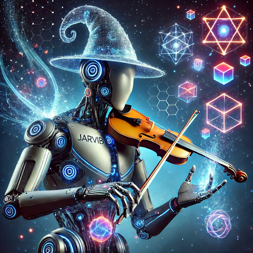
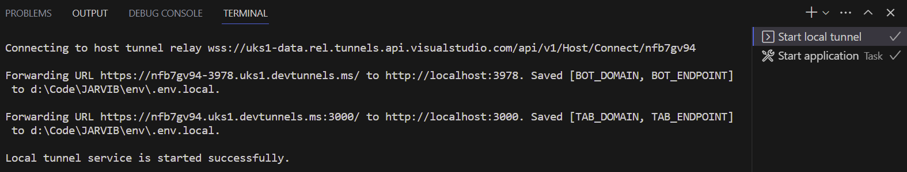
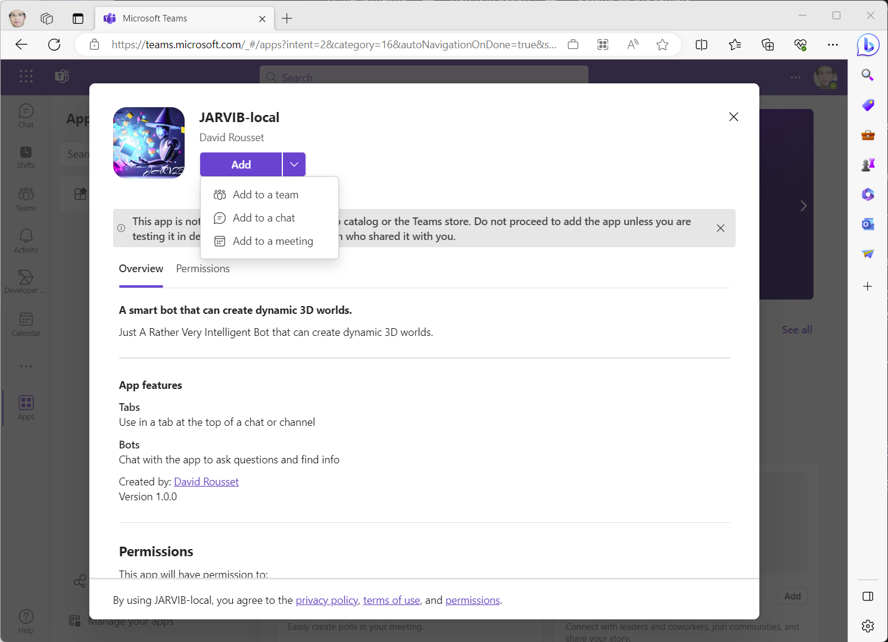
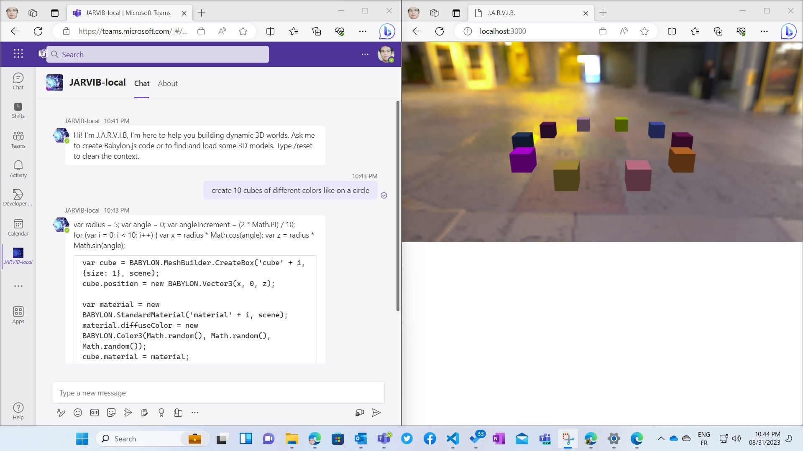
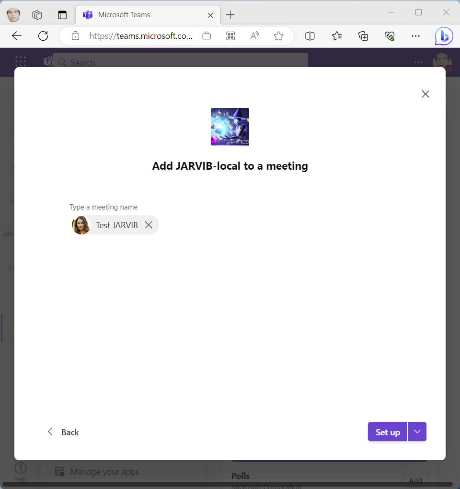
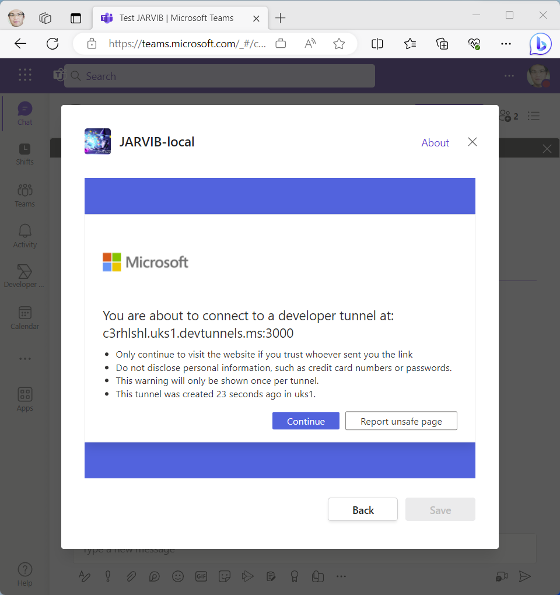
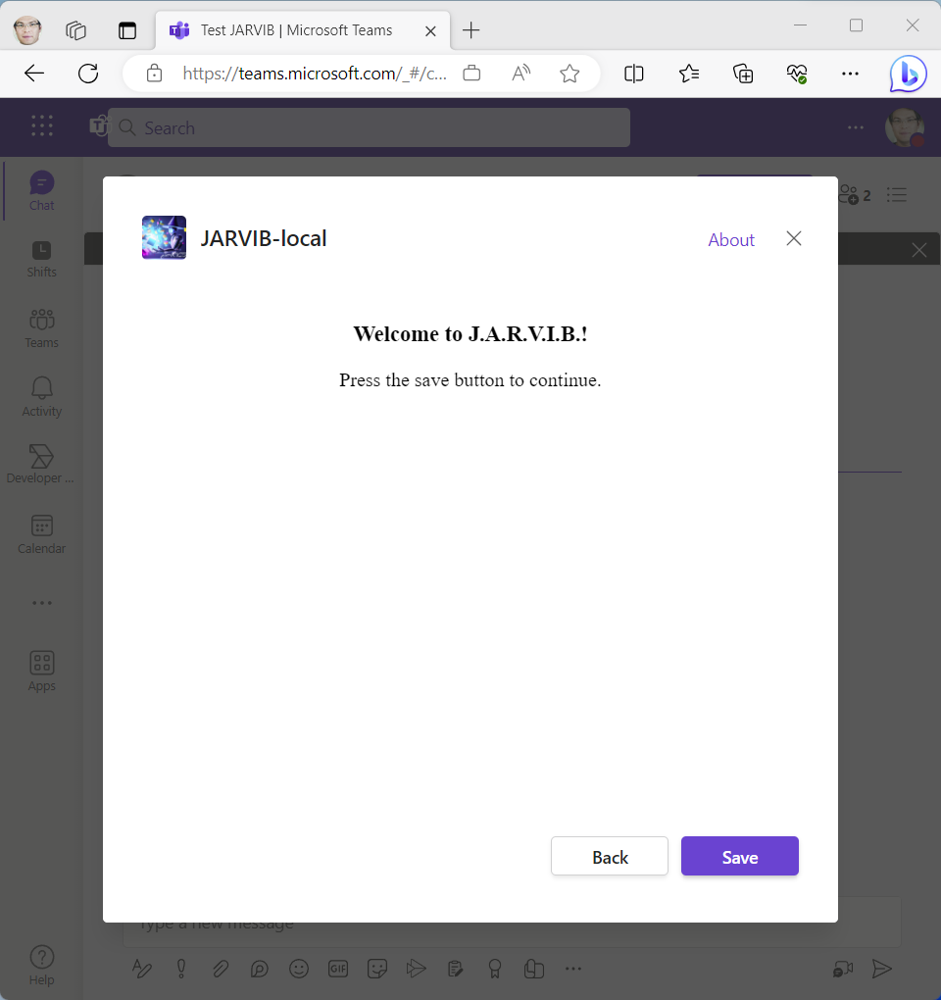
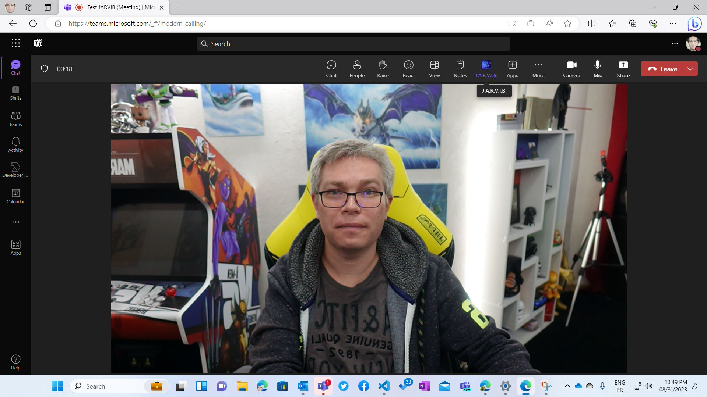
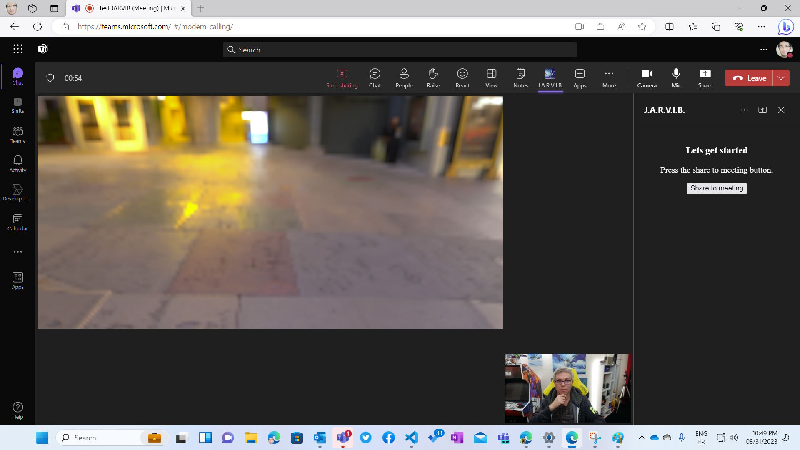
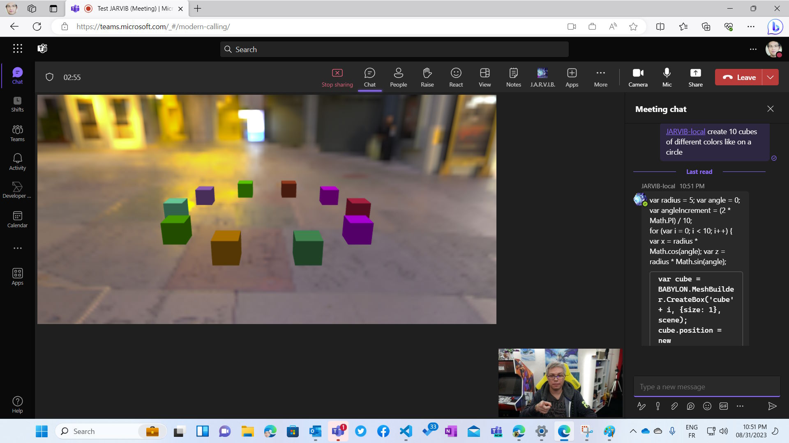

# AI in Microsoft Teams: Musical J.A.R.V.I.B. (v2)

*Your custom Microsoft Teams AI Copilot to build interactive dynamic 3D worlds — now powered by the Teams SDK v2*



Musical JARVIB (Just A Rather Very Intelligent Bot) is your personal Copilot to help you design 3D worlds in a collaborative way inside a personal conversation or in a Teams meeting, including from a MIDI instrument! Ask it to create various Babylon.js primitives or to search for specific models to load them into the scene. You can also send MIDI notes to let the AI create the scene! Look at possible prompts in `promptsExamples.txt`.

> **Note:** This project was originally built with the Teams AI v1 library and has been **fully refactored to use the [Teams SDK v2](https://www.npmjs.com/package/@microsoft/teams.apps)** (`@microsoft/teams.*` packages). See [What changed in v2](#what-changed-in-v2) for a summary.

<!-- @import "[TOC]" {cmd="toc" depthFrom=1 depthTo=6 orderedList=false} -->

<!-- code_chunk_output -->

-   [AI in Microsoft Teams: Musical J.A.R.V.I.B. (v2)](#ai-in-microsoft-teams-musical-jarvib-v2)
    -   [View it in action](#view-it-in-action)
    -   [What changed in v2](#what-changed-in-v2)
    -   [Architecture overview](#architecture-overview)
    -   [Server-side code validation](#server-side-code-validation)
    -   [Setting up the sample](#setting-up-the-sample)
    -   [Interacting with the bot](#interacting-with-the-bot)
    -   [Further reading](#further-reading)

<!-- /code_chunk_output -->

## View it in action

[](https://www.youtube.com/watch?v=E3vmDroIqj4)

## What changed in v2

| Area | v1 (Teams AI library) | v2 (Teams SDK) |
|---|---|---|
| **Core SDK** | `@microsoft/teams-ai` | `@microsoft/teams.apps`, `@microsoft/teams.ai`, `@microsoft/teams.api`, `@microsoft/teams.cards`, `@microsoft/teams.openai`, `@microsoft/teams.dev` |
| **App bootstrap** | `Application` class with adapter & bot config | `new App()` from `@microsoft/teams.apps` with plugin system (`DevtoolsPlugin`) |
| **AI / Prompts** | External prompt templates (`skprompt.txt`) + action handler registrations | `ChatPrompt` with inline `.function()` chaining — functions are defined right next to the prompt |
| **LLM model** | Configured via `OpenAIModel` with planner | `OpenAIChatModel` from `@microsoft/teams.openai` |
| **State management** | Built-in `TurnState` / storage providers | In-memory `Map<string, ConversationState>` keyed by conversation ID |
| **Action / function calling** | `app.ai.action()` handlers registered separately | `.function(name, description, schema, handler)` chained on `ChatPrompt` |
| **Event handling** | `app.activity()` / `app.message()` | `app.on('message', ...)` with middleware pattern (`next()`), `app.on('install.add', ...)`, `app.on('meetingStart', ...)`, etc. |
| **Adaptive Cards** | Raw JSON payloads | Typed constructors: `AdaptiveCard`, `TextBlock`, `CardImage` from `@microsoft/teams.cards` |
| **AI attribution** | Manual | `MessageActivity(content).addAiGenerated()` marks responses as AI-generated |
| **Manifest** | Standard bot | Adds `copilotAgents.customEngineAgents` section |
| **Node.js** | >=16 | **>=20** |
| **Express** | v4 | **v5** |
| **Package version** | 1.x | **2.0.0** |

## Architecture overview

JARVIB uses the Teams SDK v2 `ChatPrompt` with **function calling** to map user intent to 4 functions:

- **`codeToExecute`** — takes the Babylon.js code generated by the LLM and sends it to the web page containing the 3D canvas to execute it via WebSocket
- **`listAvailableModel`** — uses the same API as PowerPoint to find existing 3D models and returns a list of available models to load through an Adaptive Card built with typed constructors
- **`loadThisModel`** — loads one of the models exposed in the list displayed before
- **`transformMusicNote`** — transforms music notes (do, re, mi, fa, sol, la, si) into Babylon.js 3D objects placed randomly in the scene

Additionally, any JavaScript code blocks in the AI's text response are **auto-detected and executed** in the 3D canvas.

### Commands

- **/reset** — clears the conversation state and reloads the 3D canvas to start from scratch
- **/fullcode** — returns all Babylon.js code executed so far so you can copy/paste it in your project or in the Babylon.js Playground

### How functions are defined (v2 style)

In the new SDK, functions are defined inline on the `ChatPrompt` instance rather than in separate action handlers and JSON files:

```typescript
const prompt = new ChatPrompt({
  instructions: buildInstructions(state),
  model,
  messages,
})
  .function(
    'codeToExecute',
    'Returns the Babylon.js JavaScript code matching the user intent',
    {
      type: 'object',
      properties: {
        code: { type: 'string', description: 'The JavaScript code to execute next' },
      },
      required: ['code'],
    },
    async ({ code }) => {
      socketapp.emit('execute code', code);
      state.fullCode += code + "\n";
      await send(`<pre>${code}</pre>`);
      return 'Code executed successfully';
    }
  )
  // ... more .function() calls chained
```

The system prompt is built dynamically in `buildInstructions()` inside `src/index.ts`, injecting the current model list, last loaded model, and all code executed so far.

### Meeting events

The app registers handlers for Teams meeting lifecycle events:

- `meetingStart` / `meetingEnd` — welcome and farewell messages
- `meetingParticipantJoin` / `meetingParticipantLeave` — logging participant activity

### Socket.IO streaming

For the MIDI-driven "pseudofinal" and "final" demos, JARVIB uses a direct Azure OpenAI client (`@azure-rest/ai-inference`) with **SSE streaming** to generate and stream Babylon.js code in real time to the 3D canvas via Socket.IO.

## Server-side code validation

LLM-generated Babylon.js code can contain hallucinated API calls or incorrect property accesses that would cause JavaScript errors on the client. To prevent this, JARVIB validates all LLM-generated code **server-side** before sending it to connected clients.

### How it works

The validation layer uses the Babylon.js [`NullEngine`](https://doc.babylonjs.com/setup/support/serverSide) — a headless version of the Babylon.js engine that runs in Node.js without WebGL or a browser. A server-side scene mirrors the client's scene setup (camera, light, skybox parameters) and **accumulates state** across validations, just like the client does.

```
LLM generates code → Validate in NullEngine sandbox → Pass? → Emit to clients via WebSocket
                                                      → Fail? → Re-prompt LLM with error → Retry (up to 3x)
                                                                                          → All fail? → Skip, notify user
```

### Validated code paths

| Code path | Validated? | Why |
|---|---|---|
| `codeToExecute` (Teams chat function calling) | ✅ Yes | LLM-generated, hallucination-prone |
| Auto-detected code blocks in AI responses | ✅ Yes | LLM-generated |
| `handleMusicNote` (MIDI → 3D objects) | ❌ No | Hardcoded template code |
| `loadThisModel` (model loading) | ❌ No | Deterministic template code |
| `pseudofinal` / `final` (streaming demos) | ❌ No | One-shot streaming scenes |

### Key design choices

- **Persistent scene** — The validator scene is *not* reset between validations. Since LLM code is cumulative (new code references previously created meshes by name), the server-side scene must keep the same state as the client. It is only reset when the user sends the `/reset` command.
- **Automatic retry** — On validation failure, the server asks the LLM to fix the code using the error message, up to 3 times. If all retries fail, the code is **not sent** to the client and the user is notified in the Teams chat.
- **NullEngine limitations** — `camera.attachControl` is stubbed (requires a DOM element). Remote asset loading (GLB/GLTF) may fail gracefully server-side but the code structure is still validated.

### Files

- `src/validator.ts` — NullEngine sandbox with `validateBabylonCode()` and `resetValidatorScene()`
- `src/codeRetryHelper.ts` — `validateAndRetry()` orchestration with configurable max retries
- `src/index.ts` — `askLLMToFixCode()` helper that re-prompts Azure OpenAI to fix broken code

## Setting up the sample

### Prerequisites

- **Node.js >= 20**
- [M365 Agents Toolkit for VS Code](https://learn.microsoft.com/en-us/microsoftteams/platform/toolkit/install-teams-toolkit)
- An Azure OpenAI resource (or OpenAI API key)

### Steps

1. Clone the repository

    ```bash
    git clone https://github.com/davrous/musicalJARVIB.git
    ```

2. Install dependencies

    ```bash
    npm install
    ```

3. Set your Azure OpenAI key, endpoint, and deployment name in the `.env` file (or the appropriate `.localConfigs` / `.localConfigs.testTool` file for Teams Toolkit).

    Required environment variables:
    - `AZURE_OPENAI_API_KEY`
    - `AZURE_OPENAI_ENDPOINT`
    - `AZURE_OPENAI_DEPLOYMENT_NAME` (use the **Deployment name**, not the Model name)
    - `AZURE_OPENAI_API_VERSION` (defaults to `2024-08-01-preview`)

    If you get an HTTP 404 error during execution, you likely entered the wrong endpoint or deployment name.

4. Press **F5**!

    The Teams Toolkit will:
    - install all dependencies and build the TypeScript code
    - register the bot in Microsoft Entra ID
    - build the Teams manifest file and upload it to the Teams Developer Portal
    - create 2 dev tunnels to expose your localhost on public URLs (see `.vscode/tasks.json`):
        - 1 for the bot itself mapped on port **3978**
        - 1 for the tab / WebSocket server mapped on port **3000**
    - launch the Teams web app to let you install the bot / meeting extension

5. If everything goes well, you should first see that the 2 tunnels have been created:



6. Then, the web server will be launched and you'll be asked to install JARVIB in your developer tenant:



You can either simply press the "*Add*" button and this will install the app to let you discuss with it directly as a classical bot.

You can also add it to an existing meeting to replicate the full experience showcased in the video.

## Interacting with the bot

The easiest way to try it is to simply press F5 using the default configuration of the project. It will then run the bot locally on your machine and will launch the "Test Tool" that simulates the Microsoft Teams chat. Then, open http://localhost:3000/debug.html in a tab, http://localhost:3000/midi.html in another one. Use the "Test Tool" to chat with the AI and check the output on the VS Code console logs and inside the debug.html page.

To use the pseudofinal & final demos, use the MIDI page, use the right checkbox to switch between the various modes, play some notes and send them to the LLM. The LLM should stream back its answer directly inside http://localhost:3000/pseudofinal.html & http://localhost:3000/final.html via WebSocket. Then, the full code will be executed in the WebGL canvas with the Babylon.js engine.

Then, if you'd like to try in Teams, you need an M365 tenant. Log into the M365 tenant, check you have apps sideloading enabled. Choose to Debug in 'Teams (Edge)' and then install the app using the "*Add*" button as a bot, then open http://localhost:3000/debug.html on the side as a 3D canvas WebSocket client. Then ask the bot to create 3D content, load some models and so on:



The other option to replicate the full experience is to load the app inside an existing meeting:



You need to accept connecting to the VS Dev Tunnel redirecting to your localhost developer machine:



Finally, save JARVIB as an app part of this chosen Teams meeting:



Now, launch the Teams meeting alone or with someone else to collaborate with:



Click on the JARVIB icon and then click on the "*Share to meeting*" button:



Finally, call the AI bot via @JARVIB-local following your order:



## Project structure

```
src/
├── index.ts            # Main entry point — App setup, event handlers, ChatPrompt with functions
├── config.ts           # Environment variable configuration
├── responses.ts        # Randomized response templates
├── validator.ts        # Server-side Babylon.js NullEngine code validation sandbox
├── codeRetryHelper.ts  # Validate-and-retry orchestration for LLM-generated code
├── app/
│   └── socketapp.ts    # Express + Socket.IO server (port 3000)
└── prompts/            # Legacy prompt files (kept for reference)
    ├── chat/
    │   ├── skprompt.txt
    │   ├── actions.json
    │   └── config.json
    ├── finalprompt.txt
    └── pseudofinal.txt

public/               # Static HTML pages served by the Socket.IO server
├── debug.html        # Debug 3D canvas
├── final.html        # Final Jurassic Park demo canvas
├── midi.html         # MIDI controller page
├── midicar.html      # MIDI car controller
├── pseudofinal.html  # Pseudo-final demo canvas
└── index.html

appPackage/
└── manifest.json     # Teams manifest (v1.24) with copilotAgents section
```

## Further reading

- [Teams SDK v2 (teams.apps)](https://www.npmjs.com/package/@microsoft/teams.apps)
- [Azure OpenAI](https://learn.microsoft.com/en-us/azure/ai-services/openai/overview)
- [Microsoft 365 Agents Toolkit Overview](https://learn.microsoft.com/en-us/microsoftteams/platform/toolkit/teams-toolkit-fundamentals)
- [How Microsoft Teams bots work](https://learn.microsoft.com/en-us/azure/bot-service/bot-builder-basics-teams?view=azure-bot-service-4.0&tabs=javascript)
